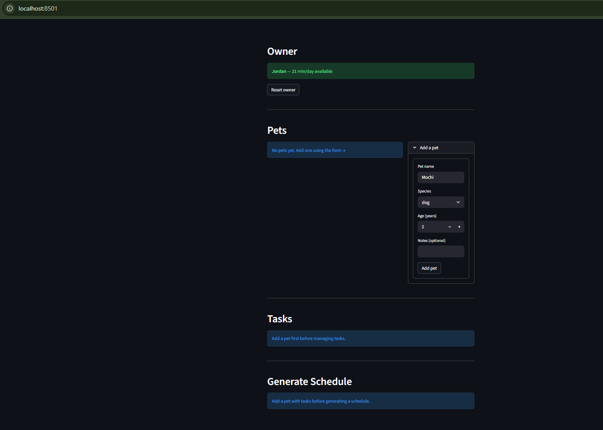

# PawPal+

A Streamlit app that helps busy pet owners plan and track daily care
tasks for one or more pets — automatically prioritized, conflict-checked,
and explained in plain English.

---

## 📸 Demo



The app shows the owner's daily time budget at the top, a pet roster
with an inline "Add a pet" form, a task manager gated behind pet
creation, and a one-click schedule generator.

---

## Features

### Owner & Pet Management
- **Owner profile** — set your name and total available minutes per day;
  the scheduler uses this as a hard time budget.
- **Multi-pet support** — add as many pets as you like (dog, cat, rabbit,
  bird, other); each pet owns its own task list.
- **Pet notes** — record special needs or health information per pet.

### Task Management
- **Rich task attributes** — every task has a title, duration, priority
  (High / Medium / Low), category (Exercise, Feeding, Medication,
  Grooming, Enrichment), preferred time of day, and optional notes.
- **Recurrence** — tasks carry a `Frequency` (None / Daily / Weekly) and
  a `due_date`; completing a recurring task automatically creates the
  next occurrence using Python's `timedelta`.
- **Weekday recurrence** — `recurrence_days` lets a task appear only on
  specific days of the week (e.g. medication on Mon / Wed / Fri).

### Smarter Scheduling Algorithms

#### Sorting
- **Sort by priority** — ranks tasks HIGH → MEDIUM → LOW; ties within a
  tier break on preferred time of day (Morning before Afternoon before
  Evening), so the most urgent, time-sensitive work lands first.
- **Sort by time** — orders any task list chronologically by
  `preferred_time` for a human-readable top-to-bottom daily view.

#### Filtering
- **Filter due tasks** — returns only tasks whose `recurrence_days`
  include today's weekday, so the scheduler never surfaces tasks that
  aren't due yet.
- **Composable task filter** — narrow by completion status, category,
  and preferred time of day; each active parameter layers on top of
  the previous result.
- **Filter by pet or status** — search across all pets and get
  `(pet_name, task)` pairs; scope to a single pet or to incomplete
  tasks only.

#### Budget Fitting
- **Greedy packing with slack reduction** — selects tasks that fit
  within the owner's daily time budget; within each priority tier,
  larger tasks are packed first to minimise wasted minutes.

#### Conflict Detection
- **Overlap detection** — `ScheduledTask.overlaps_with()` uses strict
  interval logic (`start < other.end AND other.start < end`) to
  identify time conflicts.
- **Conflict warnings** — a never-crashing method checks for overlaps
  both within a single pet's schedule and across different pets,
  returning plain-English warning strings (empty list = no conflicts).
- Warnings are automatically attached to every generated schedule and
  shown in the summary output.

#### Recurring Task Completion
- **Auto-scheduling next occurrence** — marking a Daily task complete
  creates a copy due `today + 1 day`; a Weekly task creates one due
  `today + 7 days`; one-off tasks (Frequency.NONE) simply close out.

### Schedule Generation
- One-click schedule generation per pet, starting from a configurable
  start time (default 08:00).
- Output shows each task's `HH:MM-HH:MM` time window, total minutes
  used, any skipped tasks, and a plain-English explanation of the
  scheduling decisions.
- Conflict warnings surface inline with the schedule summary.

---

## Project Structure

```
pawpal_system.py   — all domain logic (Owner, Pet, CareTask,
                     ScheduledTask, DailySchedule, Scheduler)
app.py             — Streamlit UI
main.py            — console demo; exercises sorting, filtering,
                     recurrence, and conflict detection
tests/
  test_pawpal.py   — 16 unit tests across 6 groups
requirements.txt
```

---

## Smarter Scheduling

The `Scheduler` class was extended with four groups of algorithmic
improvements during Module 2.

### Sorting

- **`sort_by_priority(tasks)`** — ranks tasks HIGH -> MEDIUM -> LOW.
  Ties within a priority tier are broken by time of day
  (MORNING before AFTERNOON before EVENING), so the most important,
  time-sensitive work lands first in the day.
- **`sort_by_time(tasks)`** — orders any task list chronologically
  by `preferred_time`, useful for a human-readable daily view
  independent of priority.

### Filtering

- **`filter_due_tasks(tasks, for_date)`** — returns tasks due on a
  given date using each task's `recurrence_days` list (0=Mon…6=Sun),
  supporting tasks that recur on specific weekdays only.
- **`filter_tasks(tasks, ...)`** — composable filter by completion
  status, `Category`, and `TimeOfDay`; each active parameter
  narrows the result of the previous one.
- **`filter_by_pet_or_status(pets, ...)`** — searches across all
  pets and returns `(pet_name, task)` pairs, optionally scoped to
  one pet or to incomplete tasks only.

### Recurring Tasks

- `CareTask` now carries a `Frequency` (NONE / DAILY / WEEKLY)
  and a `due_date`.
- **`CareTask.next_occurrence()`** uses `timedelta` to compute the
  next due date: `timedelta(days=1)` for DAILY,
  `timedelta(weeks=1)` for WEEKLY, `None` for one-off tasks.
- **`Scheduler.mark_task_complete(pet, title)`** marks the task
  done and automatically appends its next occurrence to the pet's
  task list so tomorrow's schedule is always up to date.

### Conflict Detection

- **`detect_conflicts(scheduled_tasks)`** — low-level O(n²)
  pairwise check via `ScheduledTask.overlaps_with()`; returns
  raw conflict pairs.
- **`conflict_warnings(named_schedules)`** — never-crashing wrapper
  that accepts `(pet_name, DailySchedule)` pairs, checks for
  overlaps within and across pets, and returns plain-English
  warning strings (empty list = no conflicts).
- Warnings are auto-attached to every `DailySchedule` from
  `generate_schedule()` and printed by `get_summary()`.

### Budget Fitting

- **`fit_to_budget(tasks, available_minutes)`** — greedy packing
  with a within-tier duration sort (largest tasks first per
  priority tier) to reduce wasted slack vs. naive first-fit.

---

## Testing PawPal+

### Running the tests

```bash
python -m pytest tests/test_pawpal.py -v
```

### What the tests cover

The test suite has **16 tests** across six groups:

- **Task Completion (1)** — `mark_complete()` flips `is_complete`
  from False to True.
- **Task Addition (1)** — `add_task()` grows the pet's task list
  by exactly one each call.
- **Sorting (3)** — `sort_by_time` returns
  MORNING → AFTERNOON → EVENING → ANY; `sort_by_priority` orders
  HIGH → MEDIUM → LOW; ties within a priority tier break on
  time of day.
- **Recurrence (3)** — Completing a DAILY task adds a task due
  tomorrow; WEEKLY adds one due in 7 days; `Frequency.NONE` tasks
  never produce a follow-up.
- **Conflict Detection (5)** — Same-start-time flagged; partial
  overlap flagged; back-to-back tasks sharing only a boundary are
  **not** a conflict; `conflict_warnings` returns readable strings;
  non-overlapping tasks return an empty list.
- **Edge Cases (3)** — Pet with no tasks produces a valid empty
  schedule; zero time budget skips all tasks; `remove_task` with
  an unknown title is a safe no-op.

### Confidence Level

**4 / 5 stars**

The core scheduling pipeline — sorting, filtering, budget fitting,
recurrence, and conflict detection — is well-exercised and all 16
tests pass. One star is withheld because the midnight time-wrap edge
case (a task starting near 23:59) and multi-pet cross-schedule
conflict scenarios are not yet covered, and the greedy
`fit_to_budget` is a heuristic that can miss optimal packing
combinations.

---

## Getting started

### Setup

```bash
python -m venv .venv
source .venv/bin/activate  # Windows: .venv\Scripts\activate
pip install -r requirements.txt
```

### Run the Streamlit app

```bash
streamlit run app.py
```

### Run the console demo

```bash
python main.py
```

### Suggested workflow

1. Read the scenario carefully and identify requirements and edge
   cases.
2. Draft a UML diagram (classes, attributes, methods,
   relationships).
3. Convert UML into Python class stubs (no logic yet).
4. Implement scheduling logic in small increments.
5. Add tests to verify key behaviors.
6. Connect your logic to the Streamlit UI in `app.py`.
7. Refine UML so it matches what you actually built.
