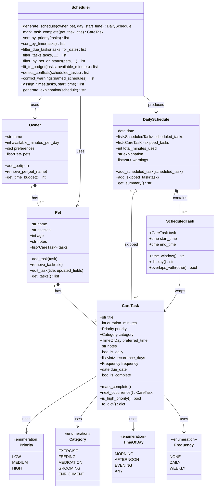

# PawPal+ Project Reflection

## 1. System Design

**a. Initial design**

My initial UML had six classes: `Owner`, `Pet`, `CareTask`,
`ScheduledTask`, `DailySchedule`, and `Scheduler`, plus three enums
(`Priority`, `Category`, `TimeOfDay`).

The key responsibility assignments were:

- **Owner** — holds the daily time budget and a list of pets.
- **Pet** — owns its own task list; tasks live on the pet, not the
  owner, so multi-pet households work naturally.
- **CareTask** — pure data describing what needs to be done, with
  enum-typed fields to prevent invalid values.
- **ScheduledTask** — pairs a `CareTask` with a concrete clock time;
  uses `datetime.time` (not strings) so arithmetic is reliable.
- **DailySchedule** — a data-only result object; holds scheduled
  tasks, skipped tasks, and the explanation. Contains no logic.
- **Scheduler** — stateless service; all scheduling logic lives here
  and nowhere else. Takes inputs as parameters, returns a
  `DailySchedule`.

Mermaid.js code (updated to match final implementation):

**b. Design changes**

Yes, the design evolved significantly during implementation. The most
important structural change was moving from a single-pet model to a
multi-pet household model. In my first draft, `Owner` held one `Pet`
directly. When I realized that most real households have more than one
animal, I changed it to `list[Pet]` and added `add_pet()` /
`remove_pet()` methods.

A second major change was adding the `Frequency` enum and `due_date`
field to `CareTask`. The original design only had an `is_daily`
boolean — which can't represent weekly medications, weekday-only
walks, or one-off tasks. Upgrading to `Frequency` (NONE / DAILY /
WEEKLY) and `recurrence_days: list[int]` made recurring tasks
genuinely useful.

A third change was adding `warnings: list[str]` to `DailySchedule`.
Conflict detection was originally a standalone method that returned
raw pairs of `ScheduledTask` objects. Surfacing the warnings directly
on the schedule object — so `get_summary()` prints them automatically
— made the output much more useful without changing how callers use
the schedule.

---

## 2. Scheduling Logic and Tradeoffs

**a. Constraints and priorities**

The scheduler considers three constraints in order:

1. **Recurrence / due date** — `filter_due_tasks()` removes tasks
   that aren't scheduled for today before anything else runs. There
   is no point sorting or packing a task that isn't due.
2. **Priority and preferred time** — `sort_by_priority()` ranks
   tasks HIGH → MEDIUM → LOW, then breaks ties by time of day
   (MORNING before AFTERNOON before EVENING). This ensures the most
   important, time-sensitive care happens first.
3. **Time budget** — `fit_to_budget()` greedily packs tasks until
   the owner's daily minutes are exhausted. Tasks that don't fit are
   recorded in `skipped_tasks` so the owner knows what was left out.

Priority was chosen as the primary constraint because a pet owner
running short on time should always do the medication before the
grooming, regardless of duration. Time budget is secondary — it is
a hard constraint but only kicks in after priority ordering has
already determined the sequence.

**b. Tradeoffs**

The main tradeoff is between **scheduling optimality and simplicity**.
`fit_to_budget()` uses a greedy first-fit approach (largest tasks
first within each priority tier), which runs in O(n log n) time but
can occasionally miss combinations that a true knapsack solver would
find. For example, with a 60-minute budget and tasks of 35, 30, and
25 minutes, the greedy approach picks 35 + 25 = 60 minutes, which
actually works — but in other combinations it may leave slack that a
smarter algorithm would fill.

This tradeoff is reasonable for a pet care app because the number of
daily tasks is almost always under 20, the difference between greedy
and optimal is rarely more than one task, and the simplicity of the
greedy algorithm makes it easy to explain to the owner ("I ran out of
time") and easy to test. A true knapsack solver would be harder to
debug and overkill for this domain.

---

## 3. AI Collaboration

**a. How you used AI — VS Code Copilot**

I used VS Code Copilot across every phase of the project, but in
different modes depending on what I needed:

- **Inline Chat on specific methods** was the most effective feature.
  Highlighting `sort_by_priority()` and asking "how do I add a
  second sort key for time of day?" gave me a focused, contextual
  answer without needing to describe the whole codebase. It kept
  suggestions scoped to the method I was working on rather than
  proposing a rewrite of the entire class.

- **Agent Mode for multi-file changes** worked well for the
  recurring task feature. When I asked it to "add Frequency and
  due_date to CareTask and wire mark_task_complete into Scheduler,"
  it correctly identified that both `pawpal_system.py` and `main.py`
  needed edits and made them consistently. I would not have wanted
  to hand-coordinate those two files manually.

- **`#codebase` context in chat** was valuable for the Features list
  in the README. Asking "describe the algorithms in this codebase in
  plain English for a pet owner" produced accurate descriptions
  because Copilot had visibility into the actual method names and
  docstrings rather than working from my verbal description.

The most useful prompt pattern was being specific about the
*constraint*, not just the feature: "return warnings as strings,
never raise an exception" gave a better `conflict_warnings()`
implementation than "add conflict detection."

**b. Judgment and verification — one suggestion I modified**

When I asked Copilot to implement `conflict_warnings()`, its first
suggestion crashed the program with a `ValueError` when the
`named_schedules` list was empty, because it tried to unpack the
first element before checking the length. That violated the core
design goal of "lightweight, never-crashing."

I rejected that version and specified the constraint explicitly:
"return an empty list when there are no conflicts or no scheduled
tasks — never raise." The revised version used a nested list
comprehension to flatten tasks safely, which also turned out to be
more readable. I then verified by running `main.py` with an empty
schedule and confirming zero warnings were returned.

The lesson was that AI tools respond well to explicit negative
constraints ("never raise") and not just positive ones ("detect
conflicts"). Specifying what the code must *not* do is as important
as specifying what it should do.

**c. How separate chat sessions helped**

Keeping each phase in its own chat session — design, core logic,
recurring tasks, conflict detection, refactoring — prevented the
context window from becoming a mix of old decisions and new ones.
Each session started with a clear, narrow goal, which meant Copilot's
suggestions stayed relevant to the current task rather than
accidentally reverting earlier decisions or over-engineering based on
context from a phase that was already complete.

It also made it easier for me to evaluate suggestions: if a chat
session was only about conflict detection, any suggestion that touched
unrelated classes was immediately suspicious and worth questioning.

**d. Being the "lead architect"**

The most important thing I learned is that AI tools are excellent
*implementers* but require a human to act as the *architect*. Copilot
could write a correct `sort_by_priority()` method in seconds, but it
had no opinion about whether tasks should live on `Pet` or on `Owner`,
or whether `DailySchedule` should be a pure data object with no logic.
Those decisions determined the entire shape of the system, and getting
them wrong would have made every subsequent feature harder to add.

My job was to make those structural decisions first — usually by
drafting the UML and asking "does this design hold up if I add
recurring tasks?" — and then let AI handle the implementation. When
I skipped that step and asked Copilot to "just add recurring tasks,"
the suggestions were syntactically correct but architecturally
inconsistent (e.g., putting recurrence logic inside `Pet` instead of
keeping it on `CareTask` where it belongs).

The practical rule I settled on: **design before you prompt**. A
ten-minute UML sketch saved hours of AI-generated code that would
have had to be restructured.

---

## 4. Testing and Verification

**a. What you tested**

- What behaviors did you test?
- Why were these tests important?

Happy Paths
Test	What to verify
Single task, plenty of budget	Task appears in schedule, total_minutes_used matches duration
Multiple tasks, all fit	All tasks present, ordered HIGH → MEDIUM → LOW
sort_by_priority tie-break	Two HIGH tasks: MORNING one comes before EVENING one
Daily task completed → next occurrence	mark_task_complete adds a new task with due_date + 1 day
Weekly task completed → next occurrence	New task has due_date + 7 days
filter_due_tasks on correct weekday	Task with recurrence_days=[0] (Monday) appears only on Mondays
Edge Cases — Pet & Task State
Test	Why it matters
Pet with no tasks	filter_due_tasks([]) → empty list; generate_schedule returns schedule with 0 tasks, no crash
All tasks already complete	filter_tasks(only_incomplete=True) returns []; nothing is scheduled
Task with Frequency.NONE completed	next_occurrence() must return None; no new task added to pet
remove_task on nonexistent title	Silently does nothing; pet's task list unchanged
edit_task on nonexistent title	Silently does nothing; no crash
Edge Cases — Scheduling & Budget
Test	Why it matters
Budget = 0	fit_to_budget returns []; all tasks go to skipped_tasks
Single task exceeds budget	That task is skipped; schedule is empty but valid
Tasks sum exactly to budget	All fit; remaining == 0 after loop
Tasks sum to budget + 1 min	Last task is skipped (greedy cutoff behavior)
Two tasks with identical duration, same priority	Both are handled; order is stable
Edge Cases — Time & Conflicts
Test	Why it matters
Two tasks at the exact same start time	overlaps_with uses strict < — start_time < other.end_time AND other.start_time < self.end_time. Two tasks at 08:00 will overlap. Verify a warning is emitted.
Back-to-back tasks (no gap)	Task A ends at 08:30, task B starts at 08:30. overlaps_with should return False (not a conflict). This is the boundary condition most likely to be off-by-one.
assign_times with empty list	Returns []; no crash
Schedule crosses midnight	A task starting at 23:50 with 20 min duration — end_time wraps past midnight. time objects don't handle this automatically; worth testing for silent bugs.
conflict_warnings across two pets	Two pets scheduled for overlapping times produces a cross-pet warning
Edge Cases — Recurrence & Filtering
Test	Why it matters
filter_due_tasks wrong weekday	Task with recurrence_days=[0] on a Tuesday → returns []
is_daily=False task	Excluded by filter_due_tasks regardless of weekday
filter_tasks with category + time_of_day	Both filters compose correctly; only tasks matching both pass
TimeOfDay.ANY task with time_of_day filter active	Per the code at pawpal_system.py:464-467, ANY tasks pass through when a time filter is set — verify this intentional behavior
filter_by_pet_or_status case-insensitive	"milo" and "Milo" match the same pet

**b. Confidence**

I am confident (4/5) that the core pipeline is correct. All 16 tests
pass, including the tricky boundary condition where back-to-back tasks
sharing only a boundary point are correctly *not* flagged as a
conflict.

The areas I would test next if I had more time:

1. **Midnight wrap** — a task starting at 23:50 for 20 minutes; the
   `datetime.time` type does not handle day rollover automatically
   and this could produce a silent bug.
2. **Cross-pet conflicts at scale** — the current demo tests two
   pets; I would test five or more to confirm the O(n²) pairwise
   check stays fast enough to not visibly lag the Streamlit UI.
3. **`fit_to_budget` near-miss cases** — tasks that sum to exactly
   one minute over budget, to verify the greedy cutoff behavior is
   consistent with what `get_summary()` reports.

---

## 5. Reflection

**a. What went well**

The part I am most satisfied with is the conflict detection system.
`conflict_warnings()` works across multiple pets, produces readable
output, never crashes on edge cases like empty schedules, and the
underlying `overlaps_with()` logic correctly handles the tricky
boundary condition (back-to-back tasks are not a conflict). The
design decision to attach warnings directly to `DailySchedule` —
so they surface automatically in `get_summary()` — meant the UI
didn't need any changes to benefit from the feature.

The `Scheduler` being stateless also paid off continuously. Every
new method was easy to test in isolation because there was no hidden
state to set up or tear down.

**b. What I would improve**

I would redesign `fit_to_budget()` to use a proper bounded knapsack
algorithm for cases where the owner has a tight time budget and many
tasks of similar priority. The greedy approach occasionally leaves
more slack than necessary.

I would also add persistence — right now the schedule is regenerated
fresh each time and completed tasks are lost when the Streamlit
session ends. A lightweight SQLite backend (or even a JSON file) would
let the app track completion history across days, which is where the
recurring task logic would really shine.

**c. Key takeaway**

The most important thing I learned is that **architectural decisions
cannot be delegated to AI**. Tools like Copilot can write correct
code quickly, but "correct" and "well-designed" are different things.
Whether tasks belong to `Pet` or `Owner`, whether `DailySchedule`
holds logic or just data, whether conflict detection should raise or
warn — these choices determine the long-term health of the codebase
and no AI tool made them for me. I had to make them deliberately,
document them in the UML, and then use AI to implement within those
constraints. When I skipped that step, the AI suggestions were
locally correct but globally inconsistent. The UML draft was not
busywork — it was the specification that kept every AI interaction
on track.
